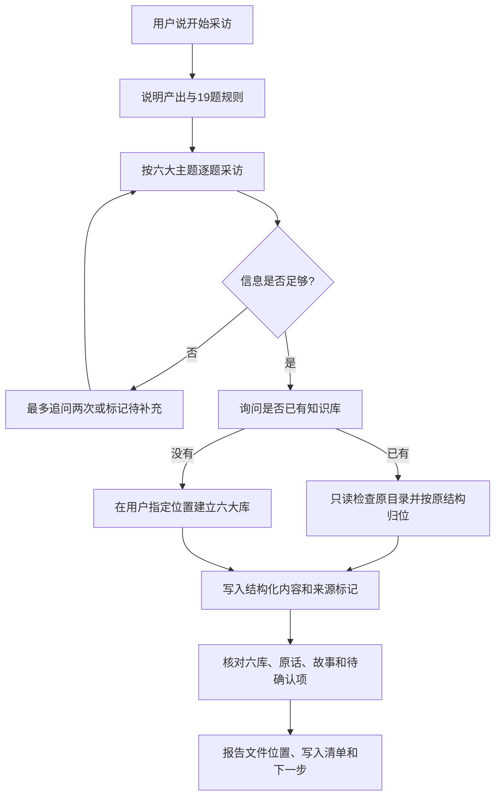

# 寂辉知识库采访

> **获取 Skill：** [安装页面](https://skills.sh/Amentman/jihui-interview) · [直接下载 ZIP](https://github.com/Amentman/jihui-interview/releases/latest/download/jihui-interview.zip) · [完整安装说明](#安装)
>
> 一行安装：`npx skills add Amentman/jihui-interview@jihui-interview -g -y`

这是一个给中文业务经营者使用的 Codex Skill。它通过一次 19 题访谈，把老板脑子里的产品、客户、案例、方法、个人定位和内容方向，整理成可以继续维护的本地知识库。

## 这个 Skill 解决什么问题

很多业务资料不是没有，而是散落在老板的聊天、经验和口头表达里。普通 AI 只能得到一句模糊介绍，写出的内容自然很空。

这个 Skill 负责把隐性经验问出来并落盘：

- 不要求用户先写一份完整商业说明书。
- 不把采访做成一次性总结，而是生成可持续补充的文件结构。
- 已有知识库时沿用原结构，不强行重建一套分类。
- 不替用户虚构案例、成绩、客户评价或经营数据。

适合一人公司、咨询顾问、门店、电商、教育服务和其他需要沉淀业务知识的人。它不适合只想生成一篇宣传文案、也不适合未经采访就批量制造案例的任务。

## 整体运行流程



一句话理解：`输入 → 处理 → 输出`，也就是“用户的口头回答 → 19 题采访与结构化整理 → 一个真实可用的知识库”。

## 开始前准备

用户只需要准备：

1. 大约 20–30 分钟。
2. 对自己业务的口头认知，不需要提前写材料。
3. 如果已有知识库，最后提供它的本地文件夹路径。
4. 如果没有知识库，最后指定一个允许新建文件的位置。

这是纯指令型 Skill，不需要 Python、Node.js、数据库或第三方 API。

## 安装

全局安装到 Codex：

```bash
npx skills add Amentman/jihui-interview@jihui-interview -g -y
```

只安装到当前项目：

```bash
npx skills add Amentman/jihui-interview@jihui-interview --agent codex --yes --copy
```

安装后，Codex 会在相关请求出现时自动发现它，也可以通过 `$jihui-interview` 明确指定。

## 第一次使用

最简单的启动方式：

```text
使用 $jihui-interview 开始采访，帮我建立第一版业务知识库。不要替我编答案。
```

如果已经有 Obsidian 或本地知识库：

```text
使用 $jihui-interview 采访我。采访结束后把内容融入我现有的知识库，不要移动或改名原文件。
```

Skill 会先说明规则，然后从 `[第 1/19 题 · 正在填：产品库]` 开始。每次只推进当前题，不会一次甩出整张问卷。

## 每一步会发生什么

| 步骤 | 用户提供或决定 | Skill 会做什么 | 可验证产物 |
|---|---|---|---|
| 1. 启动 | 说“开始采访”或明确调用 Skill | 解释用时、19 题和六大库产出 | 开场说明和第 1 题 |
| 2. 产品访谈 | 服务、客户、价格和差异 | 追问卖点及客户能听懂的表达 | 产品信息与差异化证据 |
| 3. 客户访谈 | 高频问题、好评、吐槽原话 | 保留原话，区分事实和判断 | 客户需求与异议素材 |
| 4. 案例访谈 | 一个真实客户或业务故事 | 补齐人物、场景、过程和结果 | 至少一个可讲述故事 |
| 5. 方法与个人访谈 | 行业判断、做事原则和价值观 | 抽取方法、边界和老板定位 | 方法论与老板说明书素材 |
| 6. 内容访谈 | 平台、历史内容和未来需求 | 整理内容现状和优先方向 | 内容生产库素材 |
| 7. 选择落盘方式 | 提供旧库路径或新库位置 | 检查旧结构，或创建标准六大库 | 明确的目标目录 |
| 8. 写入 | 确认目标位置 | 只新建文件写入结构化 Markdown，不修改已有文件，保留来源 | README 和六类知识文件 |
| 9. 验收 | 查看写入结果 | 核对完整性并列出缺口 | 文件清单、待确认项、下一步 |

## 输入与输出

典型输入包括：

- 用户对 19 个问题的口头或文字回答。
- 已有知识库的本地路径，或者新库的目标位置。
- 用户明确说“跳过”“不知道”或“暂停”的状态。

新建知识库时，默认输出：

```text
我的知识库/
├── README.md
├── 01-老板说明书/我是谁.md
├── 02-产品库/产品卖点.md
├── 03-客户需求库/客户画像与高频问题.md
├── 04-素材案例库/客户故事.md
├── 05-方法论库/行业判断.md
└── 06-内容生产库/内容现状与方向.md
```

已有知识库时不会硬套这套目录。Skill 会先读取目录结构，把六类内容放进最接近的既有位置；找不到合适位置时才新建“采访补充”文件夹。

每个新文件都包含来源日期。缺失事实写成“待补充”，不会为了填满页面而编造。

## 完整示例

下面是合成示例，不包含真实客户资料。

用户启动：

```text
开始采访。我做自由职业设计咨询，主要帮本地餐饮店做品牌升级。
```

采访中，Skill 会逐步追问并保留用户原话，例如：

```text
“客户不是缺一张好看的图，而是不知道为什么现在必须改。”
```

第 19 题用户回答没有旧知识库，并指定把新库放在桌面。Skill 随后：

1. 检查六类信息是否足够，不足的标成待补充。
2. 建立标准目录。
3. 把服务与定价写入产品库，把客户原话写入客户需求库，把诊断方法写入方法论库。
4. 在每条素材后保留来源和未来用途。
5. 返回实际写入路径、文件数量、六库状态和下一步建议。

完整的合成输出摘要见[合成采访示例](skills/jihui-interview/references/synthetic-example.md)。

## 失败、停止与授权边界

- 用户说“暂停”：停止提问，保留当前题号和已取得的信息，等待下次继续。
- 回答过短或抽象：最多换角度追问两次；仍没有事实就标记“待补充”。
- 没有提供落盘位置：只整理采访结果，不猜测或扫描其他私人目录。
- 已有知识库：禁止修改、移动、改名或删除旧文件；只在用户给出的目录内新建采访文件，疑似重复项交给用户决定是否合并。
- 写入失败：报告失败的具体路径，不声称知识库已经建成。
- 这个 Skill 不上传云端、不公开发布、不修改分享权限，也不代表用户授权公开客户案例。

## 如何确认真的完成

一次完整交付应同时满足：

- 19 题已经回答，或由用户明确跳过。
- 六类知识以每库至少 2 条真实信息为目标；不足的部分明确列为待补充。
- 客户高频问题以至少 3 个、好评原话至少 2 句、真实故事至少 1 个为目标；限定追问后仍达不到时，允许交付“部分完成”版本，但报告必须逐项说清缺口，不能显示为已完成。
- 最终报告包含知识库绝对位置、实际写入文件清单和六库状态。
- 已有知识库的旧文件没有被移动、改名或删除。
- 任何用户没有说过的数字、案例和评价都没有被补写。

仓库测试会检查 Skill 结构、安装入口、文档流程和链接完整性。许可证：[MIT](LICENSE)。
